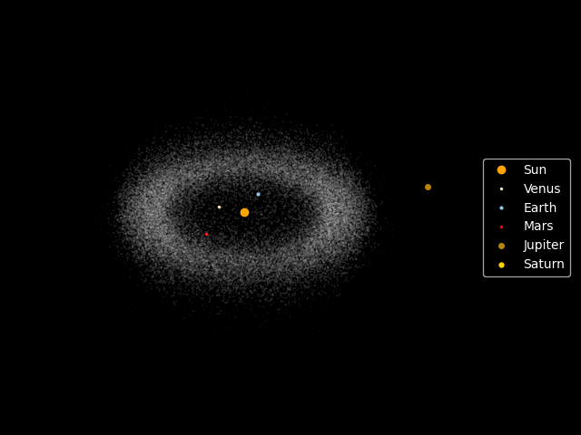
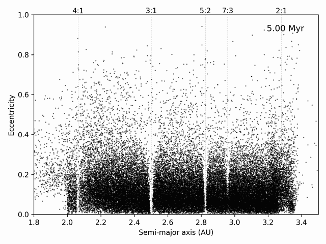
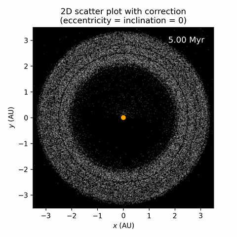
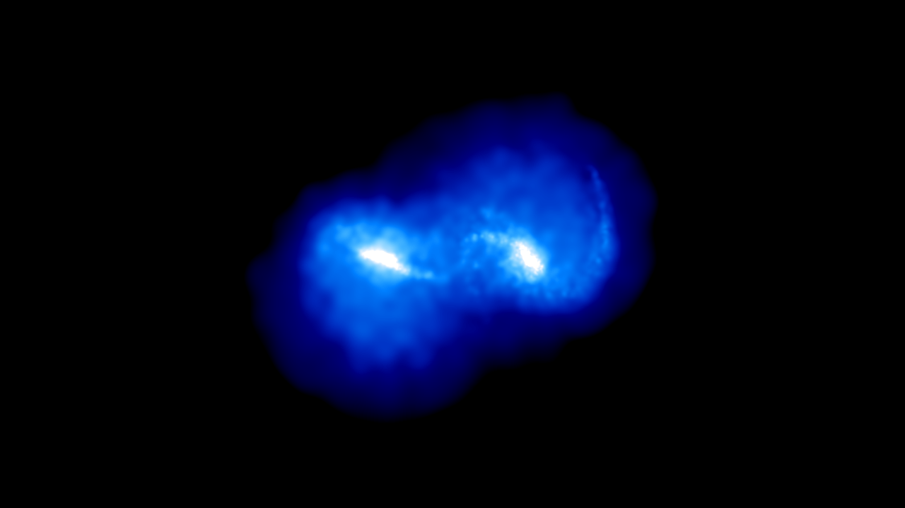
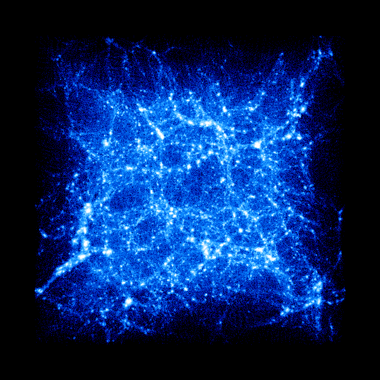

## [Evolving the solar system for 1 million years](solar_system_one_mil_yrs.ipynb)

## [Asteroid belt animation](asteroid_belt_animation/asteroid_belt.md)

## [Formation of Kirkwood gaps](kirkwood_gaps/kirkwood_gaps.md)

## [Galaxy collision](galaxy_collision/galaxy_collision.md)

## [Cosmological structure formation](cosmic_structure/cosmic_structure.md)

