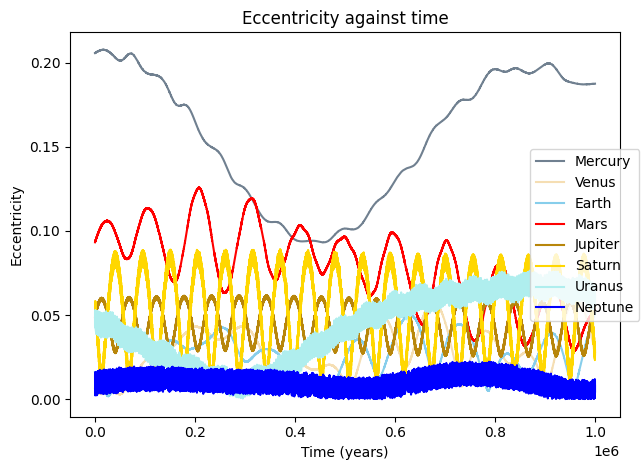
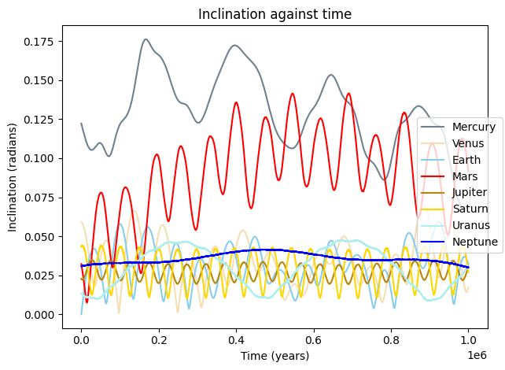

## [Evolving the solar system for 1 million years](solar_system_one_mil_yrs.ipynb)

## [Asteroid belt animation](asteroid_belt_animation/asteroid_belt.md)

<iframe width="560" height="315" src="https://www.youtube.com/embed/C45ceYja0jE?si=WrTNKP3ht_J8wxOR" title="YouTube video player" frameborder="0" allow="accelerometer; autoplay; clipboard-write; encrypted-media; gyroscope; picture-in-picture; web-share" referrerpolicy="strict-origin-when-cross-origin" allowfullscreen></iframe>

<iframe width="560" height="315" src="https://www.youtube.com/embed/eg7plHjP1eg?si=4dlGoy_msuW3o810" title="YouTube video player" frameborder="0" allow="accelerometer; autoplay; clipboard-write; encrypted-media; gyroscope; picture-in-picture; web-share" referrerpolicy="strict-origin-when-cross-origin" allowfullscreen></iframe>

<iframe width="560" height="315" src="https://www.youtube.com/embed/HMv7OwqAmBY?si=0HTV_61L_3r4CEun" title="YouTube video player" frameborder="0" allow="accelerometer; autoplay; clipboard-write; encrypted-media; gyroscope; picture-in-picture; web-share" referrerpolicy="strict-origin-when-cross-origin" allowfullscreen></iframe>

## [Formation of Kirkwood gaps](kirkwood_gaps/kirkwood_gaps.md)

<iframe width="560" height="315" src="https://www.youtube.com/embed/AEyjIF-8zT0?si=M5G8cS0i3D71PGLg" title="YouTube video player" frameborder="0" allow="accelerometer; autoplay; clipboard-write; encrypted-media; gyroscope; picture-in-picture; web-share" referrerpolicy="strict-origin-when-cross-origin" allowfullscreen></iframe>

<iframe width="560" height="315" src="https://www.youtube.com/embed/jHLLr7ACvDQ?si=O_YzbUGx_grNV2ct" title="YouTube video player" frameborder="0" allow="accelerometer; autoplay; clipboard-write; encrypted-media; gyroscope; picture-in-picture; web-share" referrerpolicy="strict-origin-when-cross-origin" allowfullscreen></iframe>

## [Galaxy collision](galaxy_collision/galaxy_collision.md)

<iframe width="560" height="315" src="https://www.youtube.com/embed/nXTUdjLXwtI?si=0MDsZFkRNru9G8l0" title="YouTube video player" frameborder="0" allow="accelerometer; autoplay; clipboard-write; encrypted-media; gyroscope; picture-in-picture; web-share" referrerpolicy="strict-origin-when-cross-origin" allowfullscreen></iframe>

## [Cosmological structure formation](cosmic_structure/cosmic_structure.md)

<iframe width="560" height="315" src="https://www.youtube.com/embed/yof2x_0IeOA?si=8f9Ip5BYmSNwQuNJ" title="YouTube video player" frameborder="0" allow="accelerometer; autoplay; clipboard-write; encrypted-media; gyroscope; picture-in-picture; web-share" referrerpolicy="strict-origin-when-cross-origin" allowfullscreen></iframe>